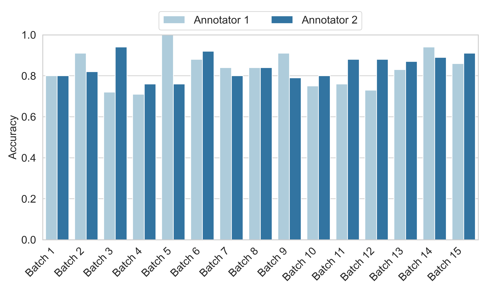

# How do people describe locations during a natural disaster: a dataset with labeled location descriptions from ten disasters

### Overall description
Social media platforms, such as Twitter/X and Facebook, have been increasingly used by people during natural disasters to seek help and share information. Messages posted on these platforms often contain critical location descriptions about victims and accidents. Recent research has shown many of these location descriptions are beyond simple place names, such as city and state names, and are in the forms of more complex and multi-entity descriptions, such as door number addresses, road intersections, and highway exits. Geo-locating these more complex location descriptions requires computational models that can recognize them as whole pieces, rather than separate entities. However, there is a lack of a large scale dataset consistently labeled in this way to train computational models. To fill this gap, we create a dataset of  social media messages posted on Twitter/X during 10 major disasters labeled with location descriptions and their associated location category and spatial footprints. The data quality is assessed based on randomly selected samples. This dataset can be used for not only understanding location descriptions used by people on social media during natural disasters but also training new AI models for extracting and geolocating those location descriptions. 

### Data description
The dataset contains 7,149 tweets related the 10 disasters. The 10 disasters include: *2017 Hurricane Harvey, 2018 California Camp Fire, 2020 Easter Tornado Outbreak, 2021 Texas Winter Storm, 2021 Kentucky Tornado, 2022 St. Louis Flooding, 2022 Hurricane Ian, 2022 Buffalo Blizzard, 2022 California Flooding, and 2023 Hawaii Firestorm*. It was collaboratively annotated by the University at Buffalo and the Geocove company. The annotators include disaster experts, GIS professionals, and GIS graduates. The annotation tool is [GALLOC](https://github.com/geoai-lab/GALLOC). 

The dataset can be downloaded at the link: https://geoai.geog.buffalo.edu/VariousResources/DisasterLocDesc_Data_Public.zip. Note that the files contain only annotations and do not include the original text of tweets. The version containing the original text is available from the corresponding author upon reasonable request.

 
Figure 1. A bar chart illustrating the annotation accuracy of two annotators across each batch.

 

### Other files
The file "DisasterLocDesc_Annotation_Guideline.pdf" provides the guidelines followed by annotators for message annotation. The four Python scripts (.py) were used to preprocess the original tweets and  annotations:
* Data_Collection.py: collect disaster-related tweets using the Twitter/X API;
* Data_Preprocessing.py: preprocess tweets through length filtering, deduplication, and location description–based filtering;
* Data_Random_Selection.py: randomly sample tweets from the preprocessed data;
* Annotations_Compare.py: compare location description annotations from annotators against the ground truth;

### Authors
* **Kai Sun** - *GeoAI Lab* - Email: ksun4@buffalo.edu
* **Yingjie Hu** - *GeoAI Lab* - Email: yhu42@buffalo.edu

### Reference
If you use the data or code from this repository, we will really appreciate if you can cite our paper:

Kai Sun and Yingjie Hu. 2025. How do people describe locations during a natural disaster: a dataset with labeled location descriptions from ten disasters.
